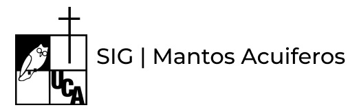
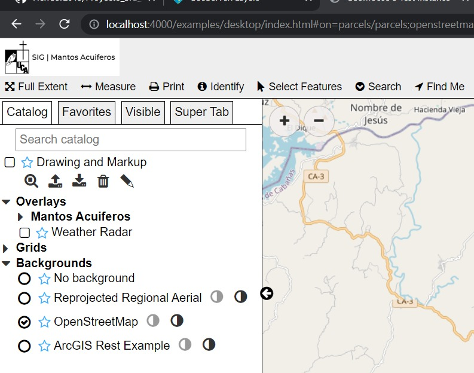
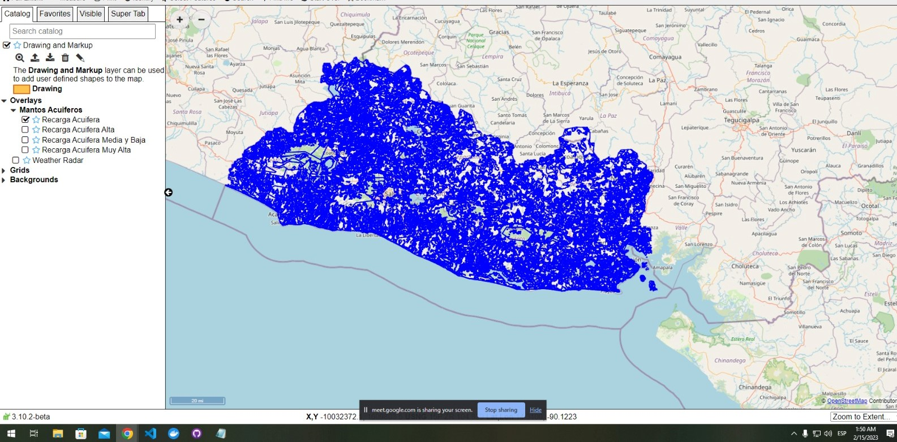
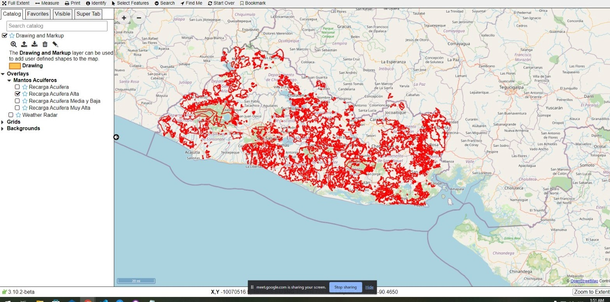
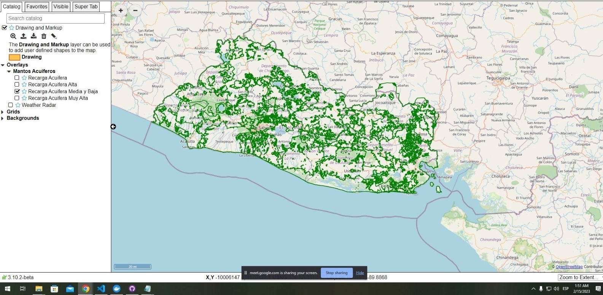
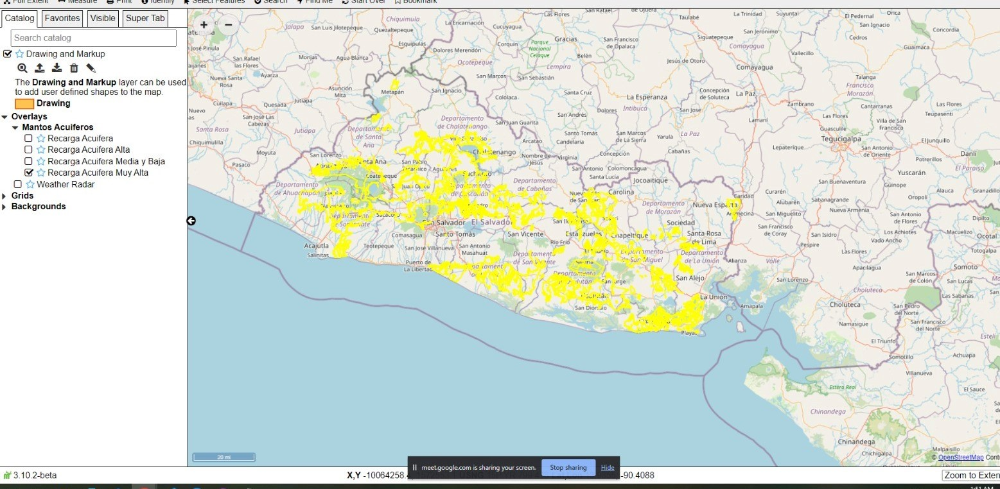
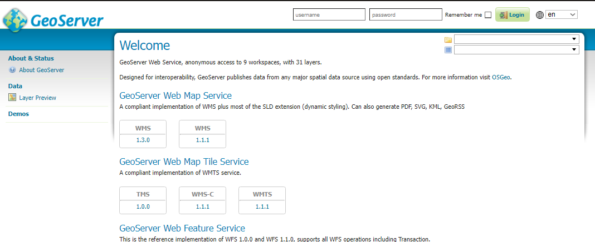
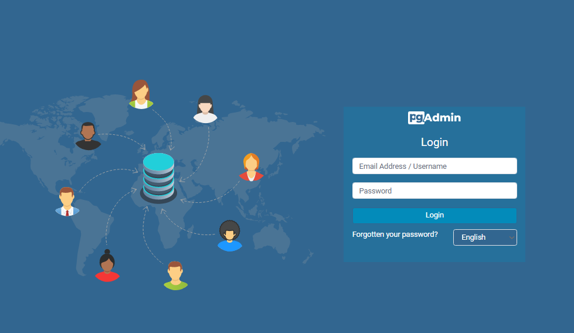

<p align="center">
  <a href="http://nestjs.com/" target="blank"></a>
</p>

## Mantos Acuiferos.

**Geoportal de mantos acuiferos de El Salvador**

### Colaboradores<a name="id11"></a>
Gracias a estas personas, fue posible la realización del proyecto:

- Mejia Galea, Rodrigo Ernesto, 00037119 
- Cortez Amaya, Henry Alexander, 00095119 
- Hernández Benitez, Manuel De Jesús, 00094119 


A continuación se redactara el manual tecnico:

## [Contenido del manual técnico.](#id1)

- [Requerimientos técnicos](#id2)
- [Docker](#id3)
  - [Configuración de variables de entorno](#id4)
  - [Inicialización docker](#id5)

## [Contenido del manual de usuario.](#id6)

- [Geomoose](#id7)
  - [Inicio rápido para GeoMoose](#id8)
  - [Personalización de la aplicación](#id9)
  - [Añadiendo las nuevas capas de datos.](#id10)
  - [Logo del geoportal](#id11)
  - [Lenguaje del geoportal](#id12)
  - [Mostrando el geoportal](#id13)
- [Usuarios de prueba](#id14)
- [Enlace del video de presentación](#id15)
- [Licencia de código](#id16)

# Contenido del manual técnico. <a name="id1"></a>
## Requerimientos técnicos<a name="id2"></a>
A continuación se presentaran los requerimientos tecnicos para instalar todas las aplicaciones o herramientas utilizadas en nuestro geoportal:

- Requerimientos minimos para utilizar docker desktop.

    - Windows 10 64-bit: Pro, Enterprise, or Education (Build 16299 o superior).
    - Procesador de 64 bits.
    - 4 GB RAM.
    - Habilitar en la BIOS la característica (el nombre varia en función del procesador que tenga tu equipo) “Intel VR” o “VR-x” o “Virtualization Technology” o «AMD-V».

- Requerimientos minimos para utilizar geomoose.

    - 4GB de RAM, 500 GB de disco duro.
    - Sistema Operativo Debian 64bits.
    - Conexión a internet.

- Requisitos minimos para utlizar geoserver.
    - Sistema Operativo: Recomendado Ubuntu 14.04 Server (64 bits)
      CPU con 4 núcleos
    - RAM: 2 GB mínimo, 4 GB recomendado
    - Disco: 8 GB para sistema y binarios. A partir de ahí, según cantidad de datos a   publicar. Raster es especialmente crítico al publicarse como GeoTIFF sin compresión y con redundancia. Dejar también margen para GeoWebCache y para manipular GeoTIFFs con GDAL.
- Los requisitos mínimos para instalar postgres:
    - 512 Mb de memoria RAM.
    - 1024 Mb máquina virtual.
    - 1 GB de espacio de disco duro.
    - Sistema operativo: Windows, Linux, MacOs o Unix.
    - Arquitectura del sistema 32/64 bit.
    - Protocolo de red TCP/IP.
- Adicionalmente, al momento de instalar postgres, se habilitara la opcion de descargar pgAdmin4, que es un DBMS para el manejo de la base de datos, y adicionalmente se puede instalar el add-on de postgis para manejar datos espaciales.


## Docker<a name="id3"></a>
Para clonar y utilizar este repositorio, es necesario tener la aplicacion de docker en nuestro ordenador. En dado caso que no este instalado docker, puede instalarlo accediendo a la **[pagina oficial de docker](https://www.docker.com/).** 

### Configuración de variables de entorno<a name="id4"></a>

#### POSTGRES WITH PG CREDENTIALS 

| Key | Value  |
|---|---|
|  POSTGRES_DATABASE|  postgisdb |
|  POSTGRES_USER| pgisdb   |
| POSTGRES_PASSWORD  | postgres  |
|POSTGRES_PORT | 5432 |

#### PG ADMIN CREDENTIALS
| Key | Value  |
|---|---|
|  PGADMIN_DEFAULT_EMAIL|  postgisdb@example.com |
|  PGADMIN_DEFAULT_PASSWORD| pgisdb   |
| PGADMIN_PORT  | 5000  |

#### EXTENSIONS
| Key | Value  |
|---|---|
|  INSTALL_EXTENSIONS|  true |
|  STABLE_EXTENSIONS| ""  |
| ROOT_WEBAPP_REDIRECT  | true |

### Inicializacion docker<a name="id5"></a>

Para inicializar docker, se debe de ingresar el siguiente comando en una terminal:

**Nota** para poder correr el proyecto correctamente, asegurarse de encontrarse en la raiz del proyecto.
```console
$ docker-compose up --build -V
```
# Contenido del manual de usuario.<a name="id6"></a>

## GeoMoose<a name="id7"></a>

Para poder empezar a trabajar en este proyecto con Geomoose, es necesario tener instalado la aplicación en nuestro ordenador. Para más informacion puede acceder a la **[pagina oficial de geomoose]( http://www.geomoose.org).** 

### Inicio rápido para GeoMoose<a name="id8"></a>

Esta guia de inicio rapido esta basada en el [quickstart de geomoose](https://docs.geomoose.org/3.x/quickstarts/index.html)

Primeramente accederemos a la aplicación dando click al icono de GeoMoose, luego se ejecutara en el navegador que se tiene por defecto.

En el navegador se desplegara una demo de GeoMoose en el que se podra interactuar para poder familiarizarse con la herramienta.

### Personalización de la aplicación<a name="id9"></a>

Una vez familiarizado con el entorno de GeoMoose, debemos de personalizar el entorno a nuestra conveniencia, utilizando datos propios, cambiar colores o la aparencia de la herramienta, etc.

#### Añadiendo las nuevas capas de datos.<a name="id10"></a>

En GeoMoose existe un archivo que se llama **Mapbook**, que es de tipo **xml**, donde se pueden administrar fácilmente las distintas capas geograficas, servicios, etc.

Este archivo esta localizado en la siguiente ruta:

```console
/Proyecto_SIG_MantosAcuiferos/geomoose/gm3/examples/desktop/mapbook.xml
```

Una vez dentro del archivo mapbook.xml, para añadir una nueva capa se debe ingresar la etiqueta **map-source** de la siguiente manera:

- Implementacion de capa "Recarga Acuífera":

```xml

    <map-source name="recarga_acuifera" type="wfs" title="Recarga Acuifera">
        <url>http://localhost:8080/geoserver/sig/wfs</url>

        <param name="typename" value="sig:Recarga_acuifera"/>
        <layer name="recarga_acuifera">
            <style><![CDATA[
            {
                "line-color" : "blue",
                "line-width" : 2
            }
            ]]></style>
            <template name="identify" auto="true"></template>
        </layer>
    </map-source>

```

- Implementacion de capa "Recarga Acuífera Alta":

```xml

    <map-source name="recarga_acuifera_alta" type="wfs" title="Recarga Acuifera Alta">
        <url>http://localhost:8080/geoserver/sig/wfs</url>

        <param name="typename" value="sig:Recarga_acuifera_alta"/>
        <layer name="recarga_acuifera_alta">
            <style><![CDATA[
            {
                "line-color" : "red",
                "line-width" : 2
            }
            ]]></style>
            <template name="identify" auto="true"></template>
        </layer>
    </map-source>

```
- Implementacion de capa "Recarga Acuífera Media y Baja":

```xml

    <map-source name="recarga_acuifera_mediaybaja" type="wfs" title="Recarga Acuifera Media y Baja">
        <url>http://localhost:8080/geoserver/sig/wfs</url>

        <param name="typename" value="sig:Recarga_acuifera_mediaybaja"/>
        <layer name="recarga_acuifera_mediaybaja">
            <style><![CDATA[
            {
                "line-color" : "green",
                "line-width" : 2
            }
            ]]></style>
            <template name="identify" auto="true"></template>
        </layer>
    </map-source>

```

- Implementacion de capa "Recarga Acuífera Muy Alta":

```xml

    <map-source name="recarga_acuifera_muyalta" type="wfs" title="Recarga Acuifera Muy Alta">
        <url>http://localhost:8080/geoserver/sig/wfs</url>

        <param name="typename" value="sig:Recarga_acuifera_muyalta"/>
        <layer name="recarga_acuifera_muyalta">
            <style><![CDATA[
            {
                "line-color" : "yellow",
                "line-width" : 2
            }
            ]]></style>
            <template name="identify" auto="true"></template>
        </layer>
    </map-source>

```
#### Logo del geoportal.<a name="id11"></a>

Para cambiar el logo del geoportal, se debe ir a la carpeta de la plantilla seleccionada (skin) y sustituir la imagen **logo.png**, que esta en la carpeta /images/ de la plantilla, por la nueva imagen del logo.

<p align="center">
  <a href="http://nestjs.com/" target="blank"></a>
</p>

#### Lenguaje del geoportal.<a name="id12"></a>

El lenguaje predeterminado de la aplicación es inglés.

#### Mostrando el geoportal.<a name="id13"></a>

Para ingresar al geoportal ya en funcionamiento, se hace mediante el puerto 4000 del localhost, siguiendo la siguiente ruta en nuestro navegador web:

```console

    localhost:4000/examples/desktop/index.html

```

Una vez accedido al link anterior, se abrira la siguiente pestaña:

<p align="center">
  <a href="http://nestjs.com/" target="blank"></a>
</p>

Luego en el geoportal se puede ya observar las distintas capas que importamos anteriormente, la cual se muestra de la siguiente forma:

- Vista de la capa "Recarga Acuífera"

<p align="center">
  <a href="http://nestjs.com/" target="blank"></a>
</p>

- Vista de la capa "Recarga Acuífera Alta"

<p align="center">
  <a href="http://nestjs.com/" target="blank"></a>
</p>

- Vista de la capa "Recarga Acuífera Media y Baja"

<p align="center">
  <a href="http://nestjs.com/" target="blank"></a>
</p>

- Vista de la capa "Recarga Acuífera Muy Alta":

<p align="center">
  <a href="http://nestjs.com/" target="blank"></a>
</p>

## Usuarios de prueba<a name="id14"></a>
Para poder acceder a la cuenta de administrador de geoserver, se deben ingresar las siguientes credenciales: 
- Usuario: "admin"
- Contraseña: "geoserver"
<p align="center">
  <a href="http://nestjs.com/" target="blank"></a>
</p>

Para poder acceder a la cuenta de administrador de postgres, se deben ingresar las siguientes credenciales: 
- Usuario: "pgisdb"
- Contraseña: "postgres"
<p align="center">
  <a href="http://nestjs.com/" target="blank"></a>
</p>

Para poder acceder a la cuenta de administrador de pgadmin4, se deben ingresar las siguientes credenciales: 
- Usuario: "postgisdb@example.com"
- Contraseña: "pgisdb"

<p align="center">
  <a href="http://nestjs.com/" target="blank"></a>
</p>

## Enlace del video de presentación<a name="id15"></a>

[Presentación Geoportal](https://youtu.be/IrEtUdcbZ4E)

## Licencia de código<a name="id16"></a>
Geoportal de Mantos Acuiferos de El Salvador esta disponible bajo la [Licencia MIT](./LICENSE).